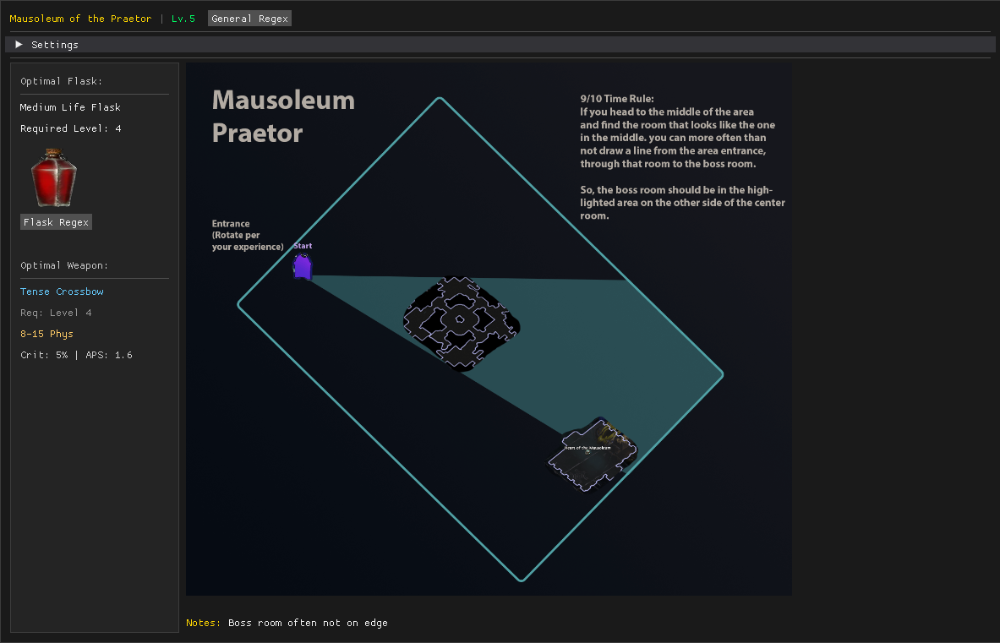

# PoE2 Campaign Layouts

A real-time utility for Path of Exile 2 that automatically displays map layouts, optimal flasks, and best weapons based on your current zone and character level.

 



## 📦 **Download & Run** (Recommended)

**No Python installation required!**

1. **Download from [GitHub Releases](https://github.com/derek-etherton/PoE2-Map-Layout-Utility/releases)**
2. **Download `poe_campaign_layouts.exe`**
3. **Run the executable** - that's it!

> 💡 **Perfect for both single and dual monitor setups!**
> The windowed application is flexible and works great whether you have one monitor or multiple monitors.

## 🌟 Features

### 📍 **Zone Detection & Map Display**
- **Real-time zone monitoring** - Automatically detects when you enter a new zone by reading the PoE2 client log file
- **Map overlay** - Displays relevant map layouts in a resizable, always-on-top window
- **Smart folder matching** - Finds maps by matching zone names to your organized map folders

### 🧪 **Flask Optimization**
- **Level-aware flask recommendations** - Shows the best life flask available for your current level
- **Visual flask display** - Displays flask icons, names, level requirements, and healing amounts
- **Regex generation** - One-click copy of flask-specific search filters for in-game use
- **Auto-updating** - Flask recommendations update automatically as you level up

### ⚔️ **Weapon Tracking** 
- **Best-in-slot weapons** - Displays optimal weapons for your selected weapon type and level
- **Detailed stats** - Shows damage, crit chance, attacks per second, and range
- **Multiple weapon types** - Supports Bows, Crossbows, Quarter Staffs, Spears, and Maces
- **Smart updates** - Weapon recommendations refresh when you level up

### 🎮 **User Experience**
- **Clean windowed interface** - Intuitive design that's easy to use alongside your game
- **Native file dialog** - Easy log file selection with built-in file browser
- **Drag & resize** - Fully customizable window positioning and sizing
- **Level detection** - Automatically detects your character level from game logs
- **Settings persistence** - Remembers your preferences between sessions

## 🚀 **Running the Application**

After downloading from the releases page, simply double-click `poe_campaign_layouts.exe`!

### 🪟 **Windowed Application**
- Standalone windowed application that works great on any setup
- Perfect for both single and dual monitor configurations
- Responsive UI that scales with window size
- Settings accessible directly in the main window via the collapsible Settings section
- Drag and resize the window to fit your preference

## ⚙️ **First-Time Setup**

**When you first run the app, you'll need to configure a few basic settings:**

### 1. **Set Your PoE2 Log File Path**
   - Click the "Browse" button
   - Navigate to your PoE2 log file (usually at one of these locations):
     - `C:\Program Files (x86)\Grinding Gear Games\logs\Client.txt`
     - `Documents\My Games\Path of Exile 2\Logs\Client.txt`
   - The app will try to find it automatically, but you can browse if needed

### 2. **Choose Your Weapon Type** (optional but recommended)
   - Select from: Bow, Crossbow, Quarter Staff, Spear, One Hand Mace, Two Hand Mace
   - This lets the app show you the best weapons for your character level

### 3. **Set Your Character Level** (optional)
   - Enter your current level
   - The app will auto-detect when you level up from the game logs

### 4. **Save Settings**
   - Click "Save Settings" to save your configuration
   - Settings are remembered for next time!

### **Accessing Settings Later:**
- Click to expand the "Settings" section in the main window

### **Advanced Settings**

#### **Regex Filter**
- Custom search pattern for in-game item filtering
- Default: `"increased rar"|move` 
- Uses regex syntax - pipe `|` means OR
- Copy these patterns to your in-game item filter

#### **Level Override**
- Check "Override player level" to manually set your level
- Useful if the app can't detect your level automatically
- Leave unchecked for automatic level detection

## 🎯 How It Works

### Zone Detection
The application monitors `Client.txt` in your PoE2 logs directory, watching for lines like:
```
[SCENE] Set Source [ZoneName]
```

### Level Detection  
Searches for level-up messages in the format:
```
: PlayerName (ClassName) is now level X
```

### Flask & Weapon Data
- Flask and weapon information stored in JSON files (`data/`)
- Automatically finds best items based on level requirements
- Updates display when character levels up

## 🔧 Troubleshooting

### Common Issues

**Maps not showing?**
- Verify your maps folder structure matches zone names
- Check that image files are PNG/JPG format
- Ensure zone detection is working (check console output)

**Level not detecting?**
- Make sure PoE2 is writing to the correct log file location
- Try manually setting level in Settings if auto-detection fails
- Restart the app after changing log file paths

**Flask images not loading?**
- Check that `images/flasks/` directory contains the referenced images
- Fallback colored rectangles will show if images are missing

**Window positioning issues?**
- Use the resize grips in bottom-right corner
- Drag anywhere on the window to reposition
- Settings are remembered between sessions

### **PoE2 Log File Locations**
- **Default**: `D:\Program Files (x86)\Grinding Gear Games\logs\Client.txt`
- **Steam**: Usually the same location
- **Documents**: `Documents\My Games\Path of Exile 2\Logs\Client.txt`

## 🤝 **Contributing & Development**

### **For Contributors & Developers**

Want to contribute or run from source? Here's the full development setup:

#### **Prerequisites**
- Python 3.7+
- Path of Exile 2 installed

#### **Installation**

1. **Clone the repository**
   ```bash
   git clone https://github.com/derek-etherton/PoE2-Map-Layout-Utility.git
   cd PoE2-Map-Layout-Utility
   ```

2. **Install Python dependencies**
   ```bash
   pip install -r requirements.txt
   ```

3. **Set up your maps directory**
   - Create a `maps/` folder in the project root
   - Organize by acts: `maps/Act1/`, `maps/Act2/`, etc.
   - Place zone folders inside: `maps/Act1/1_Clearfell/`, `maps/Act1/2_Mud_Burrow/`
   - Add map images (PNG/JPG) to each zone folder

#### **Running from Source**

```bash
python poe_campaign_layouts.py
```

#### **Building Executables**

Use the provided build script:

```bash
# Windows Batch
build.bat
```

The script will:
- Check and install PyInstaller if needed
- Clean previous builds
- Build the executable as `poe_campaign_layouts.exe`
- Display file size and completion status

#### **Project Structure**
```
PoE2-Map-Layout-Utility/
├── data/                            # Game data and images
│   ├── maps/                        # Your map images organized by act/zone
│   ├── flasks.json                  # Flask database
│   └── weapons.json                 # Weapon database
├── images/flasks/                   # Flask images
├── poe_campaign_layouts.py          # Main application source
├── flask_utils.py                   # Flask logic
├── weapon_utils.py                  # Weapon logic
├── path_utils.py                    # Resource path utilities
├── build.bat                        # Build script
└── dist/                            # Generated executable
```

#### **Contributing Ideas**
- Add support for more flask types (mana, hybrid)
- Expand weapon database
- Add zone-specific tips or strategies
- Improve map organization tools
- Add automatic map downloads
- UI/UX improvements

## 📄 License

This project is open source and available under the MIT License.

## ⚠️ Disclaimer

This tool reads log files only and does not modify game files or memory. It's designed to be a helpful reference overlay, similar to having a browser open on a second monitor. Use responsibly and in accordance with Path of Exile 2's terms of service.

---

*Happy mapping, Exile!* 🗺️⚔️
